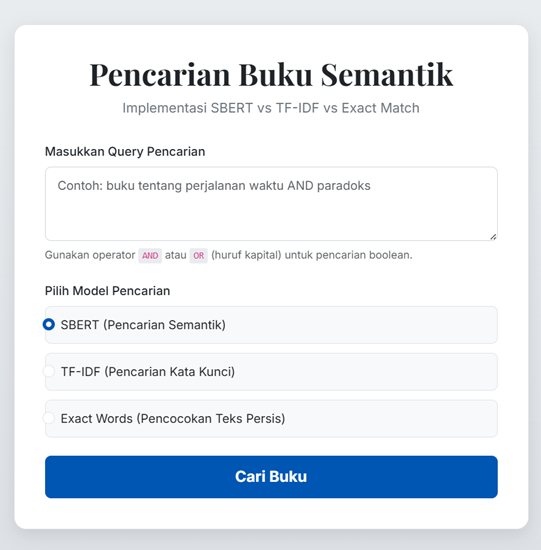

# 📚 Semantic Book Search

[](https://www.python.org/)
[](https://flask.palletsprojects.com/)
[](https://www.sbert.net/)
[](https://github.com/facebookresearch/faiss)

A semantic search engine for discovering books based on meaning, not just exact keywords.  
Built with **Sentence-BERT** and **FAISS** for fast similarity search over **100,000 books**.


---

## ✨ Features

- 🔎 **Semantic search** – understands the intent behind your query
- ⚡ **Fast retrieval** – sub-30ms response time on 100k documents
- 🌐 **Multilingual support** – works with English, Indonesian, and 50+ other languages
- 🖥️ **Clean web interface** – built with Flask and Bootstrap 5
- 📤 **Export results** – download top 10 matches as CSV or TXT

---

## 🛠️ Tech Stack

- **Backend**: Python, Flask
- **NLP & Embeddings**: Sentence-Transformers (`paraphrase-multilingual-MiniLM-L12-v2`)
- **Vector Search**: FAISS (`IndexIVFFlat`)
- **Data Processing**: Pandas, NumPy, BeautifulSoup, ftfy
- **Frontend**: HTML, CSS, Bootstrap 5, Jinja2

---

## 🚀 Quick Start

### 1. Clone the Repository

```bash
git clone https://github.com/your-username/semantic-book-search.git
cd semantic-book-search
```

### 2. Install Dependencies

```bash
python -m venv venv
source venv/bin/activate
# On Windows: venv\Scripts\activate

pip install -r requirements.txt
```

### 3. Download Precomputed Artifacts

The FAISS index, TF-IDF model, and processed metadata are too large for GitHub.  
Download them from the **Google Drive link** and place the files inside the `artefak/` folder.

Expected files:

```text
artefak/
├── df_metadata_for_app.csv
├── goodreads_faiss_ivfflat.index
├── tfidf_vectorizer.pkl
└── tfidf_matrix.pkl
```

💡 You can also regenerate these files by running the provided Jupyter notebooks:

- `preprocessing_and_SBERT.ipynb`
- `Preprocess_and_TFIDF.ipynb`

using the original Goodreads 100k dataset.

### 4. Run the Application

```bash
python app.py
```

Open the application in your browser:

```text
http://127.0.0.1:5000
```

---

## 📁 Project Structure

```text
.
├── app.py                           # Flask backend & search logic
├── requirements.txt                 # Python dependencies
├── artefak/                         # Precomputed models/index (download separately)
├── templates/
│   ├── index.html                   # Search input page
│   └── results.html                 # Results display page
├── screenshots/                     # Screenshots for documentation
├── preprocessing_and_SBERT.ipynb    # Data cleaning & embedding generation
└── Preprocess_and_TFIDF.ipynb       # TF-IDF baseline implementation
```

---

## 📸 Screenshots

| Home Page | Search Results |
|----------|----------|
|  |  |
